## Steps for using github repository in RStudio

### 1. Check Git settings in RStudio

* Check whether git is installed on your machine. 
    * on a mac open a terminal and type: `git --version`
    * you can download the latest version from (https://git-scm.com/download/)
    
* Check git setting in RStudio
    * In RStudio go to _Tools > Global Options_ and select __Git/SVN__
        
        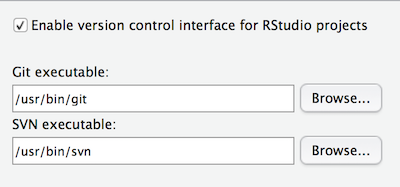
        
        It should show the path to your git installation if RStudio has been able to find it.

### 2. Create a public key and copy to github

* If you do not see a path in the __SSH RSA Key__ dialog, select __Create RSA Key__

     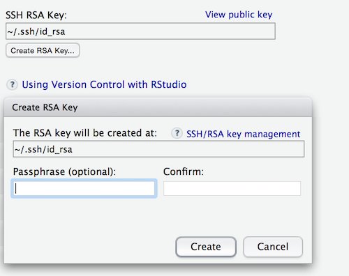
     
* Create the key and then select __View public key__ and copy it to the clipboard.

* Go to your github account and select settings from top right menu

     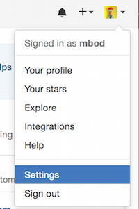
     
* Select __SSH and GPG keys__

     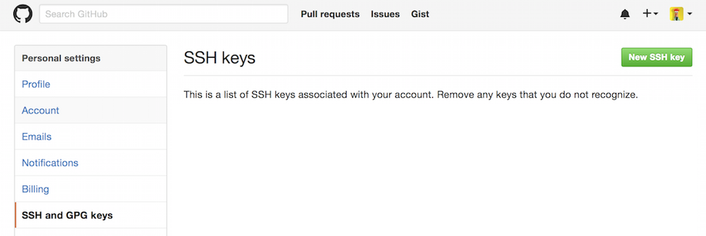

* Paste key from clipboard in the __Key__ dialog and add a title

     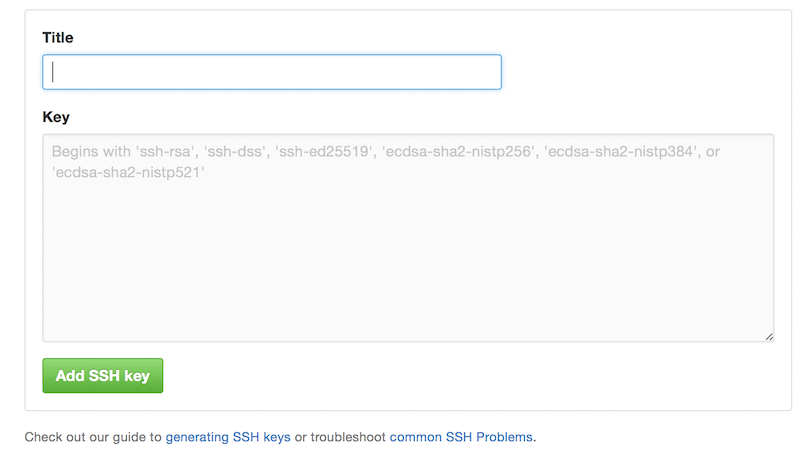
     
     
### 3. Create a new repository on your github account

* On your github home page click on the __+ icon__ in top right corner and select __New repository__

   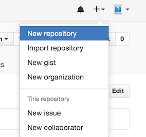


* Enter the name for the repository and select Create


   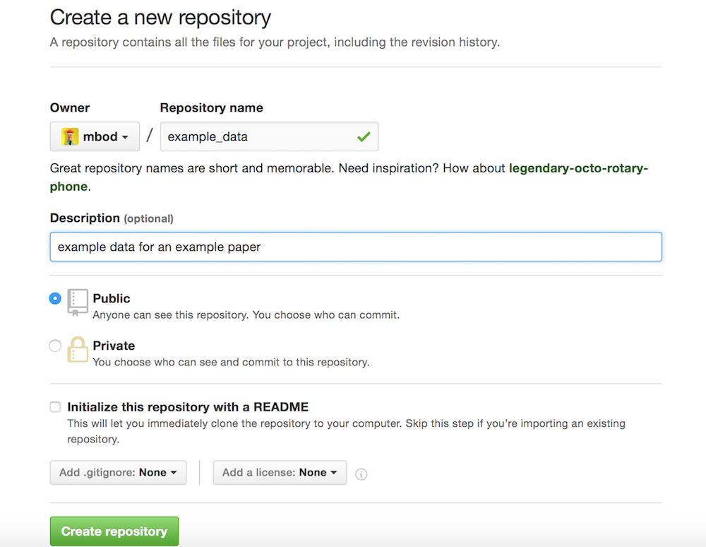


* Copy the URL for your repository

   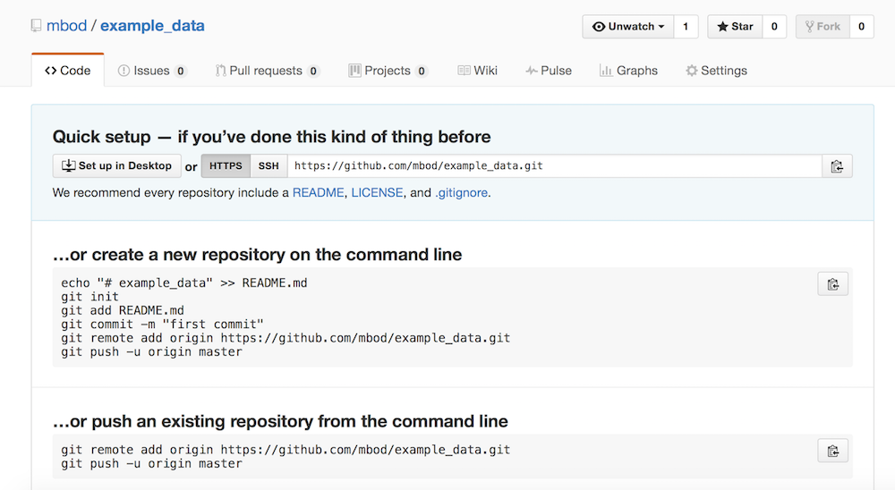

### 4. Create a new RStudio project linked to github repository

* In RStudio select __File > New Project__

* Select __Version Control__

    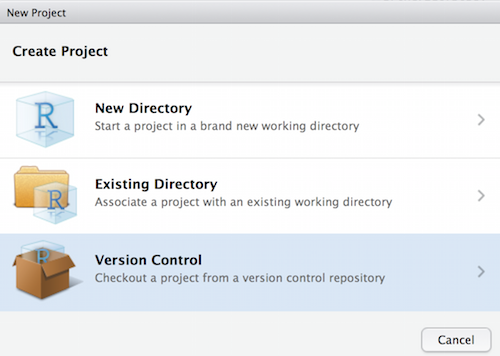
   
* Select __Git__

    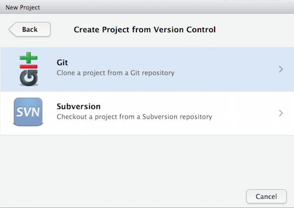

* Enter  

    1. repository URL copied from github when you setup your new repository
    2. name for the RStudio project (probably best to use same name as repository)
    3. location on your machine where you want to store the files
    4. check __Open in new session__

        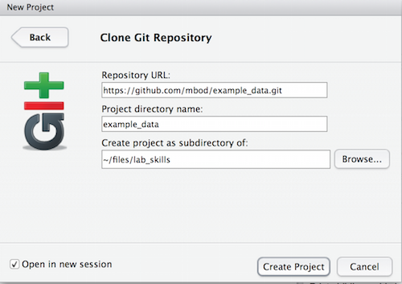

* Select __Create project__. A new RStudio session window will pop up with any files in repository pulled from github. Here there are yet any files in repository.

    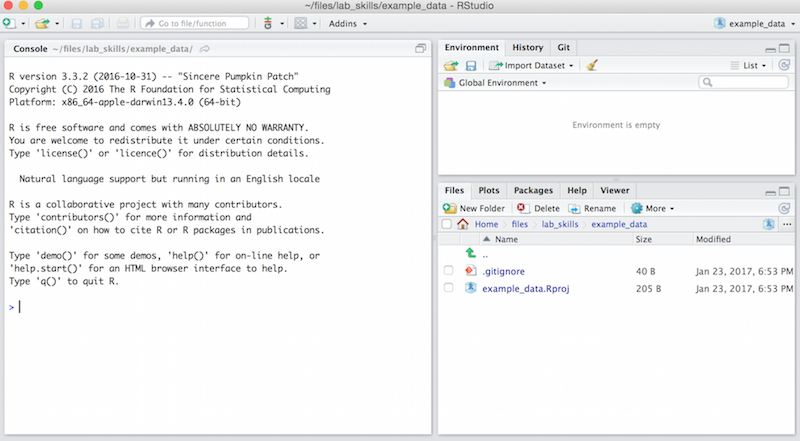
  
    
    On a mac a new RStudio icon will be shown in the dock with the project name across it 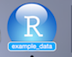
    


### 5. Add some flies to the project

* Now you can add files to the project. For example create a _New Folder_ called **data** and add a csv file, e.g.


    ```
    write.csv(mtcars, 'data/datafile.csv', row.names=F)
    ```
    
* Create a new RMarkdown file and save it in the project

    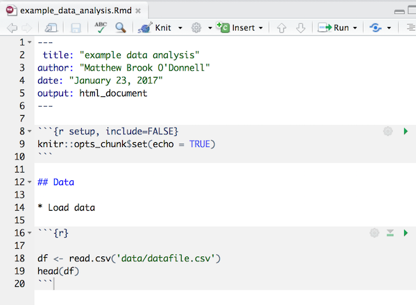
    
* All files in project are shown in the __Files__ tab. At this stage none of them are under version control

    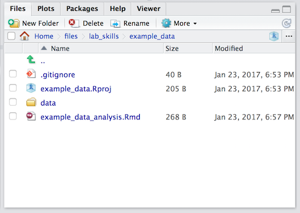


### 6. Add files to version control

* You should see a GIT menu icon at the top of the project window

    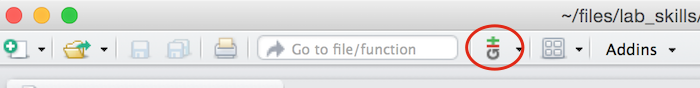
    
* Select __Commit...__

    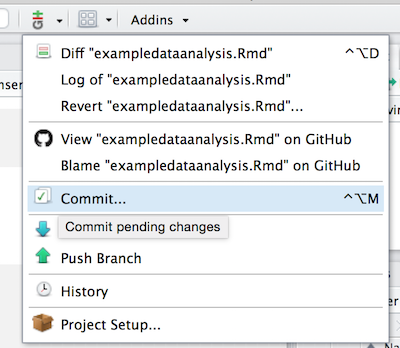
    
* The _Status__ column shows files and folders in the project that are either not under version control or have changed. To add a file or folder click the __Staged__ checkbox.

    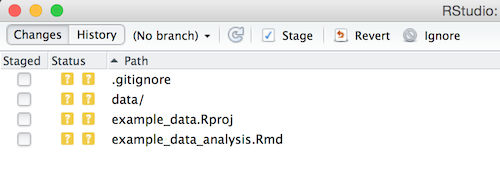

